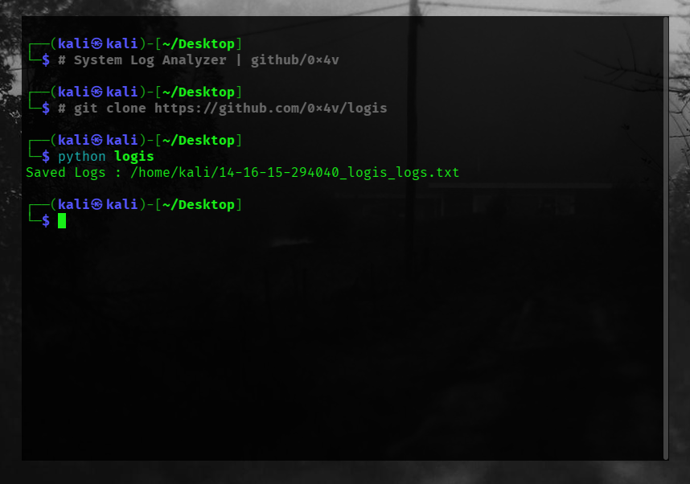

<p align="center">
  
  
  
</p>

---

## 📸 Preview
<p align="center">
  
</p>

---
<a name="en"></a>
<details open>
  <summary><b></b></summary>
  <br>
  Logis is a high-performance, Python-powered security auditing tool engineered for Linux system administrators and threat hunters. It automates the tedious process of log collection and performs deep anomaly analysis, specifically designed to accelerate incident response and streamline cybersecurity workflows.

### ✨ Key Features
- 🛡️ **Advanced Forensic Analysis:** Deep-scans critical system baselines, automatically parsing `/var/log/auth.log`, `syslog`, and `dmesg`.
- 📂 **Structured Intelligence Output:** Normalizes raw, chaotic log dumps into sleek, human-readable terminal intelligence.

### 🚀 Deployment & Usage
```bash
git clone https://github.com/0x4v/logis

python logis
